# Hyrje
Ky projekt është zhvilluar si një implementim praktik i dy algoritmeve klasike të kriptografisë: **Single Letter Grille** dhe **Tap Code**. Qëllimi i tij është të demonstrojë në mënyrë të thjeshtë dhe të kuptueshme se si funksionon enkriptimi dhe dekriptimi i mesazheve duke përdorur teknika të ndryshme të kodimit.

Nëpërmjet këtij projekti, përdoruesi mund të shohë se si një tekst i thjeshtë (plaintext) transformohet në një formë të koduar (ciphertext) dhe më pas rikthehet në formën origjinale përmes procesit të dekriptimit. Kjo ndihmon në kuptimin e bazave të kriptografisë dhe mënyrës se si informacioni mund të fshehet dhe të rikthehet.

Përveç funksionalitetit kryesor, projekti përfshin edhe një strukturë të organizuar të kodit dhe opsione për vizualizim të procesit, duke e bërë më të lehtë ndjekjen hap pas hapi të funksionimit të algoritmeve.

# Project Structure
```
Grille-TapCode-Ciphers/
│
├── ciphers/
│ ├── main.py
│ ├── single_letter_grille.py
│ ├── tap_code.py
│
├── images/
│ └── ...
│
├── .gitignore
└── README.md
```

# Ekzekutimi i programit

Për të ekzekutuar programin, ndiqni hapat e mëposhtëm:

### 1. Sigurohuni që keni të instaluar Python në sistemin tuaj

Programi është shkruar në Python, prandaj është e domosdoshme që Python të jetë i instaluar dhe i konfiguruar siç duhet në kompjuterin tuaj.
Nëse Python nuk është i instaluar, programi nuk do të mund të ekzekutohet fare.

### 2. Hapni terminalin në folderin e projektit

Hapni folderin e projektit ku ndodhen file-t e projektit, në folderin `ciphers` veçanërisht aty ku gjendet file `main.py`. Sigurohuni që të gjitha file-t e nevojshme (p.sh. algoritmet dhe main file) janë në të njëjtin folder për të shmangur gabimet gjatë importimit.

### 3. Ekzekutoni programin

Në terminal shkruani komandën:

```bash
python main.py
```
Pas ekzekutimit, programi fillon menjëherë dhe shfaq menunë kryesore interaktive në terminal.

## Program Features

Programi është interaktiv dhe i bazuar në menu, ku përdoruesi mund të:

- Zgjedhë një nga dy algoritmet kriptografike (Single-Letter Grille ose Tap Code)
- Zgjedhë një nga dy opsionet për enkriptim ose dekriptim
- Jap plaintext-in për enkriptim
- Marrë rezultatin e enkriptimit (ciphertext)
- Jap ciphertext-in për dekriptim
- Marrë rezultatin e dekriptimit (plaintext)
- Shikojë vizualizimin hap pas hapi të procesit të enkriptimit/dekriptimit (opsional)
- Dal nga programi 

Programi është ndërtuar për të demonstruar qartë procesin e enkriptimit dhe dekriptimit dhe për të ndihmuar në kuptimin e funksionimit të algoritmeve kriptografike duke mundësuar vizualizimin e procesit.

### Dalja nga programi

Për të dalë nga programi, përdoruesi duhet të zgjedhë opsionin e daljes nga menuja ose të shkruajë një input që nuk i përket opsioneve të ofruara.
Në këtë rast, programi do të mbyllet dhe do të shfaqet një mesazh konfirmimi që programi është mbyllur me sukses.

# Përshkrimi i algoritmeve
## Tap Code Cipher

Tap Code është një mënyrë shumë e thjeshtë për të koduar mesazhe tekstuale, ku çdo shkronjë përfaqësohet me dy grupe trokitjesh ose pikash. Ai bazohet në një matricë 5×5 të alfabetit latin dhe zakonisht shkronja **K** përfaqësohet nga **C**, sepse matrica ka vetëm 25 vende.

Për të transmetuar një shkronjë, fillimisht jepet numri i trokitjeve për rreshtin dhe pastaj, pas një pauze të shkurtër, numri i trokitjeve për kolonën. Për shembull, shkronja **B** jepet me një trokitje, pauzë, dhe pastaj dy trokitje. 

Kjo metodë është përdorur shpesh nga të burgosurit për të komunikuar mes tyre duke trokitur në mure, tuba ose shufra metalike. Tap Code konsiderohet i lehtë për t’u mësuar dhe praktik për situata ku nuk mund të flitet hapur.

Në këtë projekt, Tap Code përdoret për të enkriptuar tekstin duke e kthyer çdo shkronjë në pozicionin e saj përkatës në matricën 5×5.
### Enkriptimi
Në këtë projekt, enkriptimi me **Tap Code** është realizuar në Python duke përdorur një matricë **5x5** që përmban shkronjat e alfabetit. Çdo shkronjë përfaqësohet sipas **rreshtit** dhe **kolonës** ku ndodhet në këtë matricë. Për shkak se matrica ka vetëm 25 vende, shkronja **K** trajtohet si **C**.

Procesi i enkriptimit është ndërtuar me disa hapa të thjeshtë:

- Fillimisht krijohet matrica 5x5 e Tap Code.
- Pastaj përdoret funksioni `find_position(letter)` për të gjetur pozitën e një shkronje në matricë.
- Funksioni `encode_letter(letter)` e kthen një shkronjë në formën e saj Tap Code, duke përdorur pika për rreshtin dhe kolonën.
- Funksioni `encrypt_tap_code(text)` përdoret për të enkriptuar tekstin e plotë. Ky funksion:
  - e pastron tekstin me `strip()`
  - e kthen në shkronja të mëdha me `upper()`
  - kontrollon çdo karakter me `for`
  - enkripton vetëm shkronjat me `isalpha()`
  - i injoron karakteret e pambështetura
  - hapësirat i zëvendëson me `/`

Përveç enkriptimit kryesor, në projekt është shtuar edhe funksioni `visualize_tapcode_process(plainText)`, i cili tregon hap pas hapi procesin e shndërrimit të çdo shkronje në Tap Code. Në këtë pjesë është përdorur edhe moduli `time` me `time.sleep()` për ta bërë vizualizimin më të qartë.

Ky implementim e bën algoritmin të thjeshtë për t’u kuptuar, testuar dhe përdorur për enkriptimin e fjalëve dhe fjalive me Tap Code.

### Dekriptimi

Pjesa e dekriptimit në këtë projekt është zhvilluar hap pas hapi, duke ndjekur strukturën e funksioneve të ndërtuara në Python.

- Në fillim u shtua funksioni për të gjetur një shkronjë nga pozita e saj në matricën 5x5 (`find_letter_by_position`).
- Pastaj u implementua logjika e dekriptimit të një shkronje të vetme (`decode_letter`), ku kodi Tap Code ndahet në dy pjesë dhe numri i pikave përdoret për të gjetur rreshtin dhe kolonën.
- Më pas u shtua funksioni për dekriptimin e tekstit të plotë (`decrypt_tap_code`), i cili lexon çdo pjesë të kodit dhe e kthen në tekst normal.
- Në vazhdim u trajtuan edhe hapësirat, duke përdorur simbolin `/` si ndarje mes fjalëve gjatë dekriptimit.
- Për ta bërë programin më të qëndrueshëm, u shtuan kontrolle për input të pavlefshëm, në mënyrë që karakteret ose formatet jo të sakta të mos shkaktojnë gabime.
- Pas kësaj, funksionaliteti i dekriptimit u lidh me programin kryesor (`main.py`), në mënyrë që përdoruesi të mund të zgjedhë opsionin e dekriptimit nga menuja.
- Gjithashtu u shtua edhe vizualizimi i procesit të dekriptimit, për ta treguar hap pas hapi kthimin e kodit Tap Code në shkronjat përkatëse.
- Në fund u shtuan edhe shembuj testimi për dekriptimin, për të verifikuar që funksionet japin rezultate të sakta.

Ky proces e bën dekriptimin të qartë, të ndarë në funksione të vogla dhe të lehtë për t’u kuptuar, testuar dhe përdorur.

## Single-Letter Grille Cipher
**Grille Cipher** është një teknikë kriptografike me origjinë në shekullin XVI, e shpikur nga matematikani italian Girolamo Cardano rreth vitit 1550. Ajo është përdorur në komunikime diplomatike dhe ushtarake gjatë shekujve XVII–XIX. Metoda bazohet në përdorimin e një grille që vendoset mbi një fletë, ku vetëm shkronjat e dukshme përmes këtyre hapjeve formojnë mesazhin sekret dhe grille rrotullohet disa herë (zakonisht 90 shkallë).

Ne kemi implementuar variantin **Single-Letter Grille**, i cili është një formë e thjeshtuar e metodës klasike. Ndryshe nga Grille Cipher tradicional, ky variant nuk përdor rotacion të maskës. Çdo hapje në maskë korrespondon me vetëm një karakter, dhe përdoret vetëm një herë gjatë procesit të enkriptimit. Kjo e bën algoritmin më të thjeshtë për implementim, por edhe më pak fleksibël krahasuar me versionin klasik.

Sot kjo teknikë konsiderohet e pasigurt dhe nuk përdoret në kriptografinë moderne, pasi është e ndjeshme ndaj analizave si brute-force dhe analiza frekuencore. Megjithatë, ajo mbetet një shembull i rëndësishëm historik dhe një mënyrë e mirë për të kuptuar bazat e fshehjes së informacionit (steganografisë).

### Enkriptimi

Enkriptimi në Single-Letter Grille bëhet duke vendosur plaintext-in në një matricë duke përdorur një grille.

- Fillimisht krijohet një matricë bosh, me madhësi 6x6 në rastin tonë. 
- Më pas definohet maska (grille), e cila përcakton saktë pozicionet ku do të vendosen shkronjat, ku çdo pozicion përdoret vetëm një herë dhe nuk ka rotacion të maskës.  
- Plaintext-i merret dhe secili karakter vendoset vetëm në pozicionet e parapërcaktuara të maskës, një nga një sipas rendit të tij.
- Pozicionet e mbetura në matricë mbushen me karaktere të rastësishme (shkronja dhe numra), për të fshehur strukturën e mesazhit.
- Në fund, matrica lexohet rresht pas rreshti për të krijuar tekstin e enkriptuar (ciphertext).

**Ideja kryesore:** Meqë karakteret mbushëse janë të rastësishme, i njëjti mesazh mund të prodhojë ciphertext të ndryshëm sa herë ekzekutohet dhe vetëm personi që posedon maskën e saktë mund të gjej mesazhin origjinal.

### Dekriptimi

Dekriptimi në Single Letter Grille bëhet duke përdorur të njëjtën grille (maskë) që është përdorur gjatë enkriptimit.

- Fillimisht ciphertext-i ndahet në blloqe prej 36 karakteresh (6x6).
- Çdo bllok i ciphertext-it vendoset në një matricë 6x6, duke u mbushur matrica me karaktere rresht pas rreshti.
- Më pas aplikohet maska(grille), e cila përcakton saktë pozicionet ku gjendet plaintext-i.
- Karakteret lexohen vetëm nga pozicionet e paracaktuara të maskës, një nga një sipas rendit të tyre.
- Karakteret e lexuara bashkohen për të formuar mesazhin origjinal (plaintext).
- Në fund hiqen karakteret 'X' të përdorura si padding gjatë enkriptimit.

**Ideja kryesore:** Vetëm duke përdorur të njëjtën maskë mund të identifikohen pozicionet e sakta në matricë dhe të gjendet mesazhi origjinal.

# Shembuj të ekzekutimit
Pas ekzekutimit të programit, përdoruesi fillimisht do të shoh menunë kryesore në terminal:

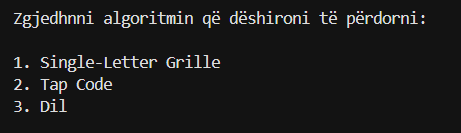

Përdoruesi zgjedh një opsion duke futur numrin përkatës dhe programi vazhdon sipas zgjedhjes:

- **1** - Aktivizohet algoritmi *Single-Letter Grille*. Programi kërkon tekstin hyrës, e enkripton atë duke përdorur matricë dhe grille, dhe më pas e dekripton për verifikim. Gjithashtu ofrohet opsioni për vizualizim të procesit.

- **2** - Aktivizohet algoritmi *Tap Code*. Programi kërkon tekstin hyrës dhe e konverton atë në kod të bazuar në koordinata (rresht dhe kolonë), pastaj e dekripton për të rikthyer tekstin origjinal. Edhe ky algoritëm ofron opsionin për vizualizim.

- **3** - Programi ndalon ekzekutimin dhe shfaq mesazhin e daljes me sukses.

Nëse përdoruesi zgjedh opsionin 1 ose 2, më pas i shfaqet një menu për të zgjedhur veprimin që dëshiron të kryejë:

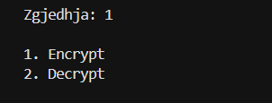

Pra përveç 1 ose 2, çdo input tjetër konsiderohet i pavlefshëm dhe nuk pranohet nga programi.

## Shembulli 1 - Single-Letter Grille

### Enkriptimi

Nëse përdoruesi zgjedh opsionin **1 (Enkriptimi)**, atij i kërkohet të japë si input plaintext-in. 
Më pas, programi gjeneron ciphertext-in e enkriptuar dhe e shfaq atë në ekran. 

Teksti i zgjedhur për enkriptim është: `shihemi ne route66`.

Hapat e enkriptimit:
1. Përdoruesi jep si input tekstin `shihemi ne route66`.
2. Programi e pastron tekstin duke hequr hapësirat dhe duke e kthyer në shkronja të mëdha.
3. Teksti ndahet në grupe dhe vendoset në një matricë 6x6 sipas rregullave të grille.
4. Pozicionet e përcaktuara nga grille mbushen me karakteret e tekstit.
5. Hapësirat e mbetura mbushen me karaktere të rastësishme.
6. Nga matrica gjenerohet ciphertext-i final.
7. Rezultati i enkriptimit shfaqet në ekran.

Në fund, përdoruesit i ofrohet mundësia të zgjedhë nëse dëshiron të shoh vizualizimin e procesit.

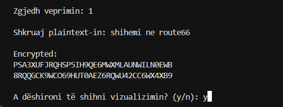

Nëse përdoruesi zgjedh **“y”** për vizualizim, programi fillon të shfaqë procesin hap-pas-hapi të vendosjes së karaktereve në matricë.

Fillimisht paraqitet një matricë bosh (6x6), ku të gjitha pozicionet janë të mbushura me simbolin `_`. Më pas, gradualisht shfaqen karakteret e plaintext-it vetëm në pozicionet e përcaktuara nga grille.

Në çdo hap:
- Një karakter i ri vendoset në matricë
- Matrica printohet përsëri për të treguar progresin
- Procesi vazhdon derisa të vendosen të gjitha karakteret e mesazhit

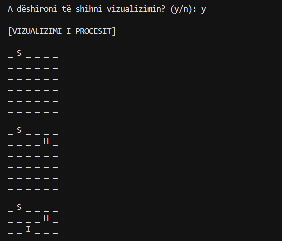

Nëse mesazhi përfundon dhe ende ka hapësira të lira në pozicionet e grille, ato mbushen me karakterin **`X`** për të plotësuar matricën.
Në rast se mesazhi është më i gjatë, procesi vazhdon në blloqe të reja (matrica të reja 6x6), dhe vizualizimi përsëritet për secilin bllok.
Pas përfundimit të vizualizimit, programi rikthehet në menunë kryesore, ku përdoruesi mund të zgjedhë përsëri algoritmin dhe të vazhdojë me enkriptim ose dekriptim.

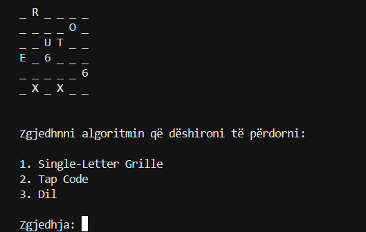

### Dekriptimi

Nëse përdoruesi zgjedh **opsionin 2 (Dekriptimi)**, atij i kërkohet të japë ciphertext-in si input.
Programi e përpunon ciphertext-in dhe rikthen tekstin origjinal (plaintext), i cili shfaqet në ekran.

Hapat e dekriptimit:

1. Përdoruesi merr ciphertext-in e gjeneruar nga enkriptimi i mëparshëm.
2. Programi e ndan ciphertext-in në blloqe 6x6 (36 karaktere për secilën matricë).
3. Çdo bllok vendoset në një matricë dy-dimensionale.
4. Duke përdorur pozicionet e grille, programi nxjerr vetëm karakteret relevante.
5. Karakteret e nxjerra bashkohen për të formuar tekstin origjinal.
6. Karakteri `X` përdoret për plotësim në rastet kur mungojnë karaktere në fund të bllokut.
7. Programi rikthen tekstin origjinal: `SHIHEMINEROUTE66`.

Në fund, përdoruesit i ofrohet mundësia për të parë vizualizimin e procesit. Nëse zgjedh **“y”**, vizualizimi zhvillohet në të njëjtën mënyrë si te enkriptimi, duke shfaqur hap pas hapi matricën dhe pozicionet e karaktereve sipas grille.

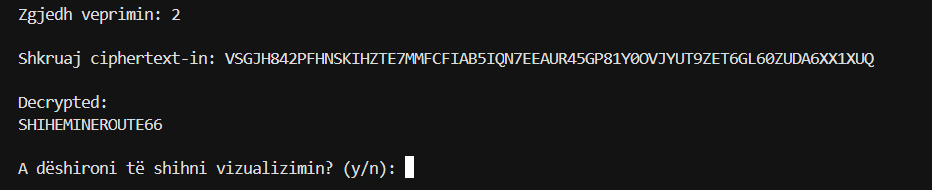

Pas përfundimit të vizualizimit, programi rikthehet në menunë kryesore, ku përdoruesi mund të zgjedhë përsëri algoritmin dhe të vazhdojë me enkriptim ose dekriptim.

Nëse përdoruesi zgjedh **opsionin 2 (Dekriptimi)** dhe fut një ciphertext të pavlefshëm (p.sh. gjatësia e tij nuk është shumëfish i 36 karaktereve, si 36, 72, 108 etj.), programi nuk e përpunon atë dhe shfaq mesazhin e gabimit:
Ky kontroll ndihmon që programi të mos ketë gabime gjatë ekzekutimit dhe të mos ndalet papritur, duke siguruar që ciphertext-i të jetë në format të saktë dhe i përshtatshëm për procesin e dekriptimit.

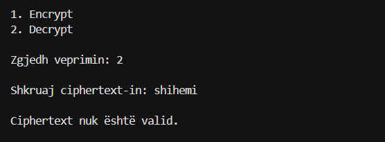

## Shembulli 2 - Tap Code 

### Enkriptimi

Ky shembull tregon mënyrën se si programi enkripton vetëm shkronjat dhe injoron karakteret që nuk mbështeten nga Tap Code.

Hapat e enkriptimit:
1. Programi merr inputin `HELLO 123`.
2. Teksti pastrohet dhe kthehet në shkronja të mëdha.
3. Çdo karakter kontrollohet me radhë.
4. Shkronjat `H`, `E`, `L`, `L`, `O` enkriptohen sipas pozicionit të tyre në matricën 5x5.
5. Hapësira kthehet në simbolin `/`.
6. Numrat `1`, `2` dhe `3` injorohen, sepse nuk janë pjesë e alfabetit të përdorur në Tap Code.

Rezultati i enkriptimit:

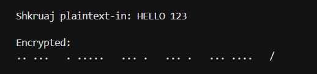

Nëse përdoruesi zgjedh opsionin **“y”** për vizualizim, programi shfaq një paraqitje hap-pas-hapi të procesit të enkriptimit ose dekriptimit (varësisht nga veprimi i zgjedhur).
Në këtë fazë, të dhënat vizuale shfaqen në terminal duke treguar si ndërtohet ose zbërthehet matrica karakter për karakter, duke e bërë procesin më të kuptueshëm.

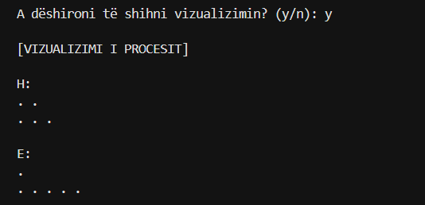

### Dekriptimi

Fjala e përdorur si shembull është e koduar në Tap Code për të paraqitur një rast të plotë dekriptimi të një fjale me disa shkronja. Ky test është i rëndësishëm sepse verifikon nëse programi i ndan saktë kodet e secilës shkronjë, i dekripton në mënyrë të rregullt dhe i bashkon për të formuar tekstin origjinal.

Është e rëndësishme të theksohet se gjatë dekriptimit përdoruesi nuk jep tekst normal, por versionin e enkriptuar në Tap Code.

Hapat e dekriptimit:
1. Përdoruesi jep si input Tap Code-in e fjalës: .. ... . ..... ... . ... . ... ....
2. Programi e ndan inputin në pjesë të veçanta duke përdorur hapësirat mes shkronjave.
3. Çdo pjesë përpunohet nga funksioni i dekriptimit (`decode_letter`).
4. Programi përdor numërimin e pikave për të përcaktuar rreshtin dhe kolonën në matricën 5x5 të Tap Code.
5. Çdo segment kthehet në shkronjën përkatëse:
- `.. ...` → `H`
- `. .....` → `E`
- `... .` → `L`
- `... .` → `L`
- `... ....` → `O`
6. Të gjitha shkronjat bashkohen në rendin e duhur.

Rezultati i fituar:

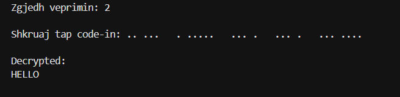

Vizualizimi për këtë rast është paraqitur në këtë mënyrë:

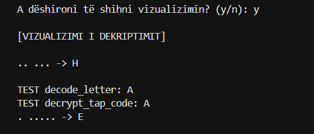
